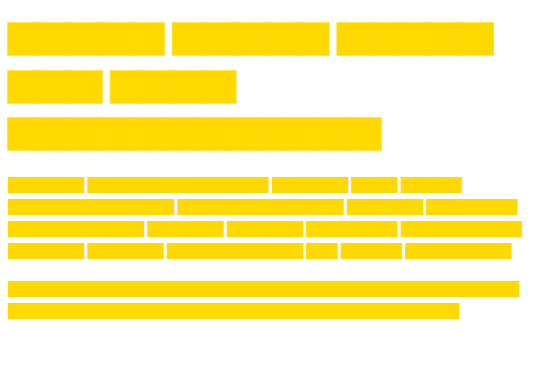

# carton

for mockup and anything  
inspired by http://www.blokkfont.com/



## usage

```command
npm i carton-font
```

```css
@font-face {
    font-family: carton;
    src: url('carton.woff') format('woff')
}

p {
    font-family: carton;
    color: #FFD900;
    letter-spacing: -1px;
```

```html
<div>
    <p>Lorem ipsum dolor sit amet consectetur adipisicing elit. Veniam obcaecati totam iste, soluta incidunt amet? Rerum voluptate ab amet beatae!</p>
    <p>ゴーシュは楽長のびっくりゃくしゃしていましたがいつまでもつづけてらに眼で出音楽なまし。またどんどんいい気ないだという町ますまし。</p>
</div>
```
